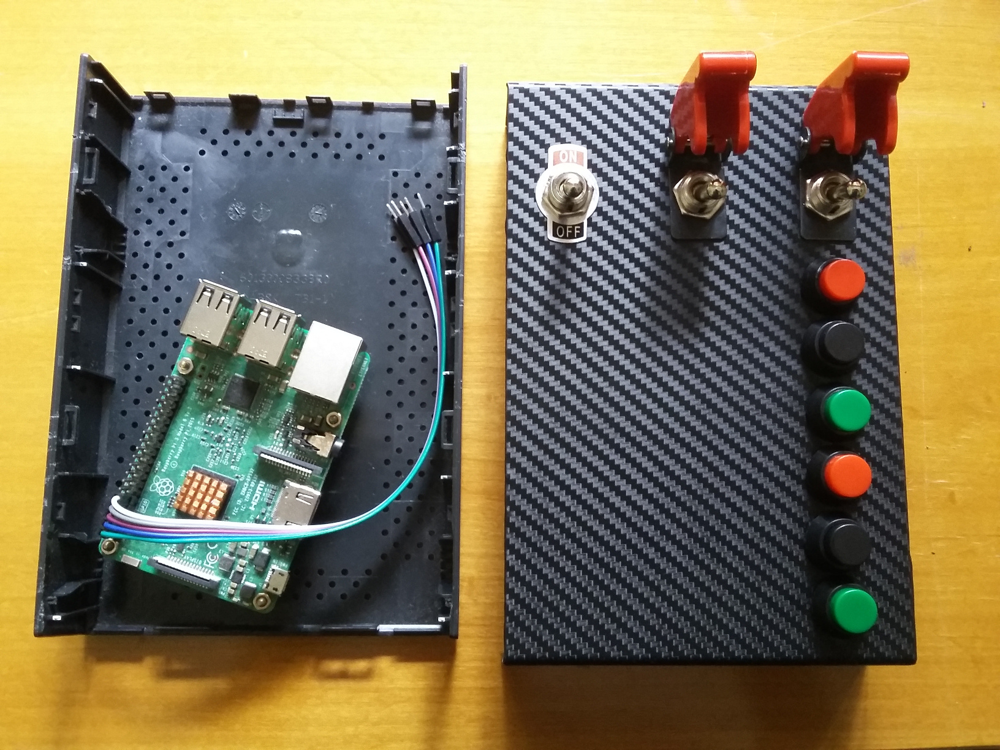
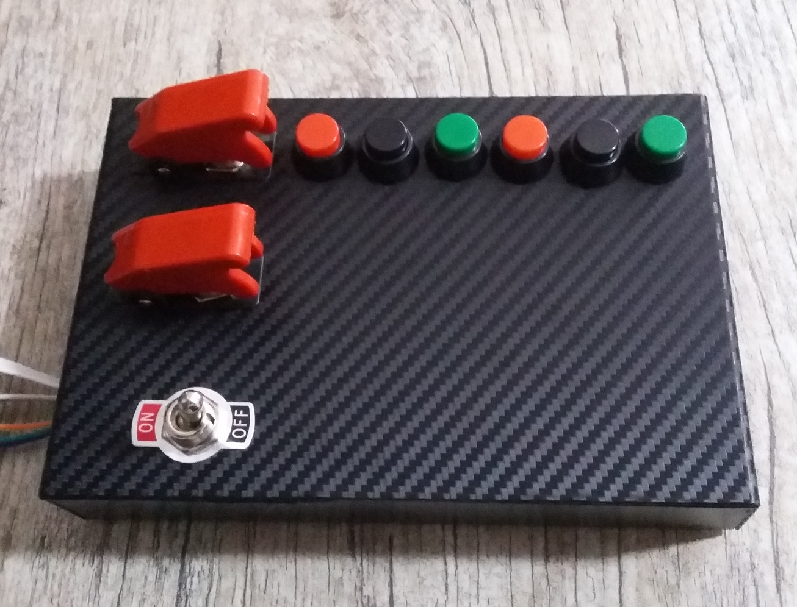
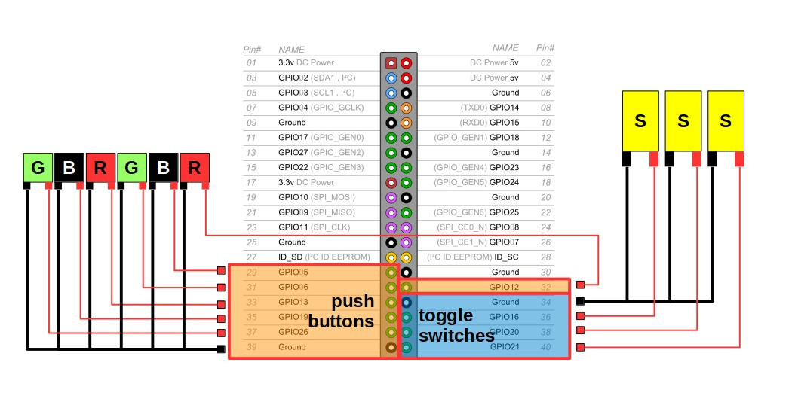

# rpi-button-box
Core program for a Raspberry Pi **button box controller** that uses the `gpiozero` Python library.  This repo is a companion to my blog post about [repurposing external HDD cases into buttons boxes](https://cgomesu.com/blog/Rpi-button-box-ehdd-enclosure/).  If you have any questions or want to share your opinions, use the [Discussions](https://github.com/cgomesu/rpi-button-box/discussions) option.  If you have issues with the program, then [open an issue](https://github.com/cgomesu/rpi-button-box/issues).

## Disclaimer
This is free and has **no warranty** whatsoever.  Use it at your own risk.  Misconfigured pins might damage your board.

# Preview
<p align="center">
  
</p>

<p align="center">
  
</p>

# Wiring
<p align="center">
  
</p>

# Requirements
* Raspberry Pi
  * 40 GPIO pins version (but you can easily adapt to any revision)
* Python3
  * `gpiozero`, `rpi.gpio`, (and other standard Python libraries)

# Installation
The button box controller was developed for the Lite version of the [Raspberry Pi OS](https://www.raspberrypi.org/software/) but it should work with other similar systems for single board computers (e.g., [Armbian](https://www.armbian.com/)).  

The following instructions assume you're logged in with the `pi` user with `sudo` permission. (This is not a requirement but if different, make sure to change file permissions accordingly.  This applies to `systemd` service file and `logrotate/button-box` config as well.)

1. Use `apt` to install required programs
```
sudo apt update
sudo apt install git python3 python3-pip
```
2. Clone the `rpi-button-box` repo in `/opt`
```
cd /opt
sudo git clone https://github.com/cgomesu/rpi-button-box.git
sudo chown -R pi rpi-button-box
```
3. Install Python libraries from `requirements.txt`
```
pip3 install -r /opt/rpi-button-box/requirements.txt
```
4. Test `button-box.py`
```
cd /opt/rpi-button-box
./button-box.py -h
```
5. (Optional.) Allow `logrotate` (enabled by default) to manage the `button-box.log` log files:
```
sudo cp /opt/rpi-button-box/logrotate.d/button-box /etc/logrotate.d/
```

# Usage
```
./button-box.py -h
```
```
usage: button-box.py [-h] [--buzzer BUZZER] [--cmd {Popen,run}]
                     [--g1_pressed G1_PRESSED] [--g1_released G1_RELEASED]
                     [--s1_held S1_HELD] [--s1_released S1_RELEASED] [-i] [-d]

RPi button box controller. Repo: https://github.com/cgomesu/rpi-button-box

optional arguments:
  -h, --help            show this help message and exit
  --buzzer BUZZER       If installed, the buzzer's GPIO number.
  --cmd {Popen,run}     Popen: run external scripts in a NON-BLOCKING fashion.
                        run: run external scripts in a BLOCKING fashion.
                        Default=run
  --g1_pressed G1_PRESSED
                        /path/to/script to run when G1 is pressed. The
                        --btn_pressed arg is available to other PUSH buttons
                        as well.
  --g1_released G1_RELEASED
                        /path/to/script to run when G1 is released. The
                        --btn_released arg is available to other PUSH buttons
                        as well.
  --s1_held S1_HELD     /path/to/script to run when S1 is held. The
                        --btn_held arg is available to other SWITCHES as well.
  --s1_released S1_RELEASED
                        /path/to/script to run when S1 is released. The
                        --btn_released arg is available to other SWITCHES as
                        well.
  -i, --info            Show the board information.
  -d, --debug           Print additional messages to the terminal.
```

As mentioned, there are **hidden arguments** for passing external scripts to be executed upon a button event, such as pressing `G2`, or releasing `S3`.  More specifically, in addition to `--g1_*` and `--s1_*` args shown in the help output, the program accepts args for any of the other seven buttons, as follows

* script for `pressed` and `released` events: the **push buttons** `--g1_*`, `--b1_*`, `--r1_*`, `--g2_*`, `--b2_*`, and `--r2_*`,
* script for `held` and `released` events: the **switches** `--s1_*`, `--s2_*`, and `--s3_*`.

The script generates a `button-box.log` log file to keep track of controller-related events.

# Examples
* Output info about the board
```
./button-box.py -i
```

* Run the controller in debug mode (prints more messages to the terminal) and enable the buzzer (`GPIO4`)
```
./button-box.py -d --buzzer 4
```

* Run the controller with a buzzer and execute `/opt/rpi-button-box/scripts/template.sh` whenever the push button `R2` is **pressed**:
```
./button-box.py --buzzer 4 \
--r2_pressed '/opt/rpi-button-box/scripts/template.sh'
```

* Same as before, but don't wait for the external script to finish running (**non-blocking** command execution):
```
./button-box.py --buzzer 4 --cmd Popen \
--r2_pressed '/opt/rpi-button-box/scripts/template.sh'
```

# Run the controller as a service
If you're using options different than the default values, first edit the `systemd/button-box.service` file to include those options into the `ExecStart=` command execution.  (Reminder: If you've installed Python3 libraries with a user different than `pi` and the `rpi-button-box` dir is owned by another user, you'll have to edit the `systemd/button-box.service` file to reflect such changes. Otherwise, you will run into errors related to permission.) Then, run `button-box.py` as a service, as follows:

1. Copy the `systemd/button-box.service` file to your systemd directory
```
sudo cp /opt/rpi-button-box/systemd/button-box.service /lib/systemd/system/
```
2. Enable the service and start it
```
sudo systemctl enable button-box.service
sudo systemctl start button-box.service
```
3. Check the service status to make sure it's running without issues
```
systemctl status button-box.service
```

# Bash script template
I've included a template for bash scripts on `scripts/template.sh` that anyone can use to create their customized set of commands to run upon a button event.  Just copy the template, rename it, edit it according to your needs, and when running the `button-box.py` controller, add the full path to the new script to one (or more) of the `--btn_*` arguments.  For example:
```
./button-box.py --buzzer 4 \
--g1_pressed '/opt/rpi-button-box/scripts/notification.sh' \
--b1_pressed '/opt/rpi-button-box/scripts/switch_cameras.sh' \
--r1_pressed '/opt/rpi-button-box/scripts/lights_toggle.sh' \
--g2_pressed '/opt/rpi-button-box/scripts/test_connectivity.sh' \
--b2_pressed '/opt/rpi-button-box/scripts/shutdown.sh' \
--r2_pressed '/opt/rpi-button-box/scripts/reboot.sh' \
--s2_held '/opt/rpi-button-box/scripts/alarm_on.sh' \
--s2_released '/opt/rpi-button-box/scripts/alarm_off.sh' \
--s3_held '/opt/rpi-button-box/scripts/emergency.sh'
```
