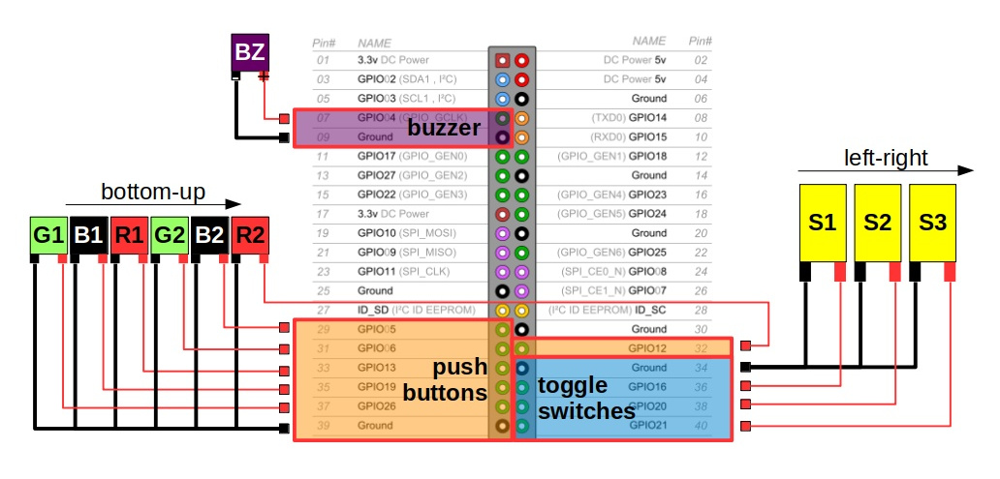

# rpi-button-box
Core program for a Raspberry Pi **button box controller** that uses the `gpiozero` Python library.  This repo is a companion to my blog post about [repurposing external HDD cases into buttons boxes](#).  

# Disclaimer
This is free and has **no warranty** whatsoever.  Use it at your own risk.  Misconfigured pins might damage your board.

# Wiring
<p align="center">
  
</p>

# Requirements
* Raspberry Pi
  * 40 GPIO pins version
* Python3
  * `gpiozero`, `rpi.gpio`

# Installation
* Python3 and libraries
```
sudo apt 
```

* Clone the repo
```
sudo apt update
sudo apt install git
cd /opt
sudo git clone https://github.com/cgomesu/rpi-button-box.git
sudo chown -R pi rpi-button-box
cd rpi-button-box
```

# Usage
```
./button-box.py -h
```
```
OUTPUT
```

# Examples
* Test the controller and if okay, just output info about the board
```
./button-box.py -i
```

* Run the controller in debug mode and the buzzer (`GPIO4`)
```
./button-box.py -d --buzzer 4
```

# Run as a service
